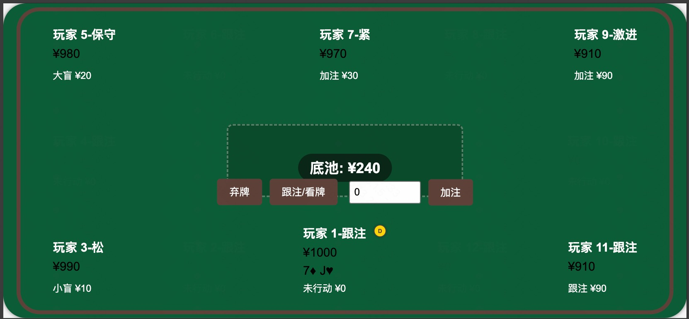

# 德州扑克小游戏

最开始想用vibe-coding方法写一个德州扑克小游戏，后来发现及时用gemini2.5、claude3.7这样的模型都没办法搞定。于是改用trae+deepseekv3的方法。

## 如何运行

npm install
npm run dev

## 如何玩

- 点击编辑模式，可以选择玩家数量和设置bot策略
- 点击下一局可以开始新的一局游戏

## 心得

vibe-coding核心是planning+evaluate+迭代。对于复杂的项目，一直顺着LLM的建议走，会容易失控。
lovable这种无代码编程方法，把背后的代码变成了黑盒，用户只能用白盒测试的方法来检验成果，逻辑上会生成很多失控的代码。这种产品范式的迭代方向可能是：
- 技术架构模版化，根据用户需求类型选择模板，然后填充细节
- 将隐性逻辑可视化，让用户可以直接修改。比如游戏机制等

## 版本记录

- demo 用youware，背后是claude3.7模型。[youware-holdem](https://nop86gcdwz.app.youware.com/)
- v0.0.0 用gemini2.5模型实现的德州扑克游戏，代码如下：[gemini-holdem](https://g.co/gemini/share/8a437f4001c1)
- v0.0.1 用trae+deepseekv3改写，把一个html拆分成html+js+css，代码如下：[trae-holdem](doc/gemini_rewrite/index.html) 但是进一步实现复杂逻辑有点麻烦，放弃。
- v0.1.0 用trae+deepseekv3生成，采样vue3+vite框架。初步实现了游戏流程。bot的策略是默认checkCall，游戏胜负是随机选择胜者。代码如下：[trae-holdem-vue](src/index.html)
- v0.1.1 添加游戏编辑模式，添加了4种bot策略，完善了游戏胜负判定。

## 未来计划

- [x] 实现bot的策略
- [x] 实现游戏胜负判定
- [x] 默认不显示对手的手牌
- [ ] 为用户提供gto胜率建议
- [ ] 把界面做的漂亮一些
- [ ] 用LLM做为bot

## 参考资料

- [EnzeD/vibe-coding](https://github.com/EnzeD/vibe-coding)
- [filipecalegario/awesome-vibe-coding](https://github.com/filipecalegario/awesome-vibe-coding)
- [gavinwalters/Vue.js-Texas-Holdem](https://github.com/gavinwalters/Vue.js-Texas-Holdem)
